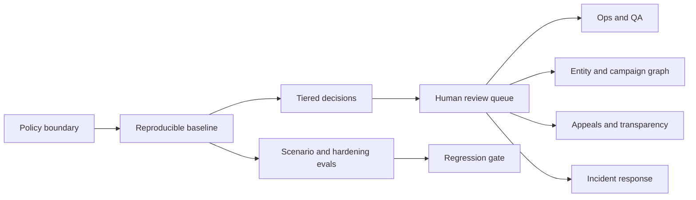

# Crypto Scam Moderation Lab

An interactive Trust & Safety workbench for investigating crypto-scam content on Bluesky-style social platforms.

The project begins with a narrow policy question: how can a platform reduce investment scams without suppressing legitimate financial speech? It turns that policy boundary into an inspectable system with model evaluation, human review, campaign intelligence, incident response, appeals, and bounded GenAI assistance.

## What You Can Explore

- A grounded overview of the investment-scam problem and policy methodology.
- A review queue with evidence, uncertainty, and tiered intervention decisions.
- A custom post tester with adjustable thresholds and protected-context handling.
- Scenario, adversarial, production-hardening, evidence, and launch-gate evals.
- A reviewer calibration simulator and incident-response replay.
- Campaign graphs over repeated domains, wallets, handles, and risk phrases.
- Appeals, reversals, user notices, and transparency metrics.
- A deterministic GenAI abuse lab with prompt-injection, tool-misuse, excessive-agency, and memory-poisoning tests.

The public demo is static and uses sanitized or synthetic examples. It cannot publish labels, report accounts, resolve live links, or take platform actions.

## System Shape



## Evaluation Snapshot

| Evaluation surface | Current artifact |
| --- | ---: |
| Reproducible baseline | 0.938 operational F1 |
| Scenario and adversarial cases | 40 |
| Production-hardening cases | 12 |
| Controlled mutation variants | 56 |
| Structured evidence cases | 19 |
| Reviewer calibration cases | 12 |
| Incident tabletop scenarios | 3 |
| Release-gate failures | 0 |

The authored suites are not presented as external benchmarks. Their purpose is to make policy boundaries, failure modes, and regression expectations executable. See [the case study](case_study/CRYPTO_SCAM_MODERATION_CASE_STUDY.md) for methodology, limitations, and interpretation.

## Repository Map

- `crypto-scam-lab/`: static interactive safety console.
- `policy_proposal_labeler_v2.py`: reproducible TF-IDF and policy-feature baseline.
- `evals/`: scenario, adversarial, hardening, and release-gate checks.
- `adversarial_lab/`: controlled scam mutation testing.
- `llm_evidence/`: structured evidence schema, extractor, and faithfulness evals.
- `bluesky_integration/`: read-only ingestion scaffolds, review store, entity extraction, and campaign graphing.
- `ops_analytics/`: SQL-readable queue and reviewer metrics.
- `quality/`: calibration guide, answer key, and QA report.
- `incident_response/`: severity model, runbook, tabletop scenarios, and postmortem structure.
- `governance/`: appeal scenarios, notice templates, reversals, and transparency report.
- `audit_outputs/`: versioned generated reports and the sanitized demo queue.
- `case_study/`: long-form project narrative and screenshots.

The original coursework implementation remains in `policy_proposal_labeler.py` for provenance. Its evaluation and model-selection issues are documented in `audit_outputs/original_labeler_audit.json`; the public workbench uses the separate v2 baseline.

## Run The Lab

```bash
cd crypto-scam-lab
python3 -m http.server 5177
```

Open `http://127.0.0.1:5177`.

## Reproduce The Release Gate

```bash
python3 -m venv .venv
source .venv/bin/activate
python -m pip install -r requirements-v2.txt
bash scripts/run_all_checks.sh
```

The same command runs in GitHub Actions. It retrains the reproducible baseline, refreshes the scenario, hardening, mutation, evidence, governance, operations, calibration, incident, and campaign artifacts, and fails when the launch gate detects a regression.

## Bluesky Boundary

The repository includes authenticated search and Jetstream ingestion scaffolds for local, read-only analysis. Credentials are read from environment variables and are never required for the public demo. Live ingestion is opt-in, bounded by explicit limits, and does not publish moderation actions.

See [the Bluesky integration guide](bluesky_integration/README.md) for local setup and privacy constraints.

## Known Limitations

- The coursework dataset is small and primarily English-language.
- Scenario and hardening suites are authored rather than untouched external benchmarks.
- Campaign examples are sanitized and deterministic.
- OCR, redirect resolution, and hosted LLM extraction remain bounded simulations or future adapters.
- The included appeal flows are authored scenarios, not a production appeals service.
- No public enforcement capability is implemented.
