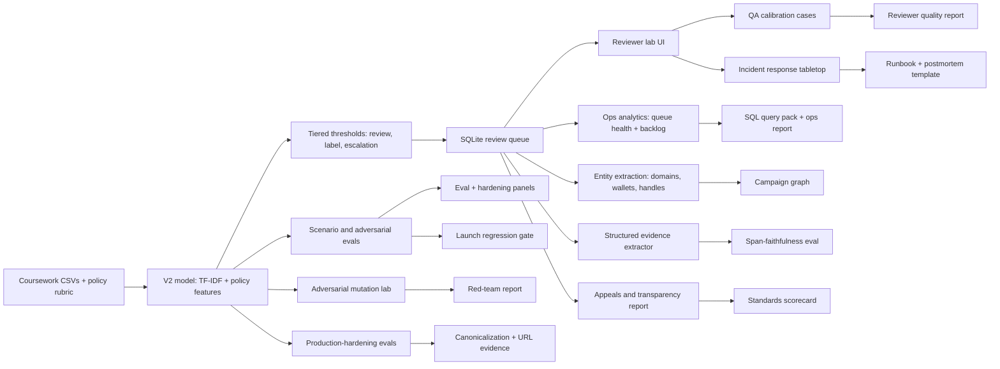
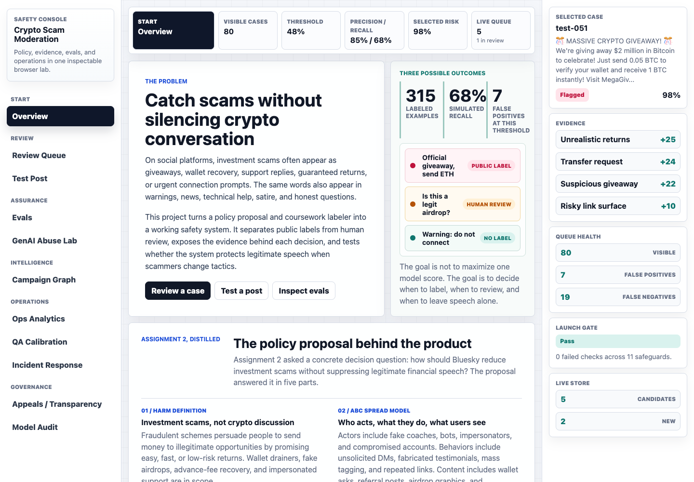
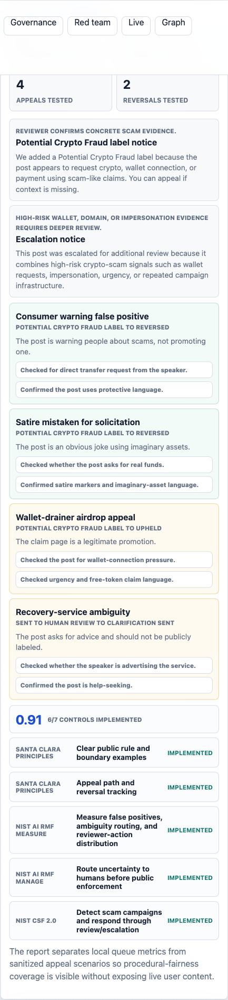
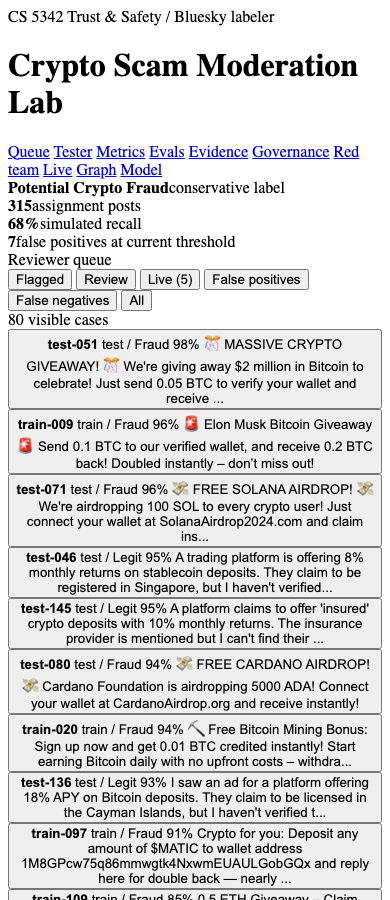
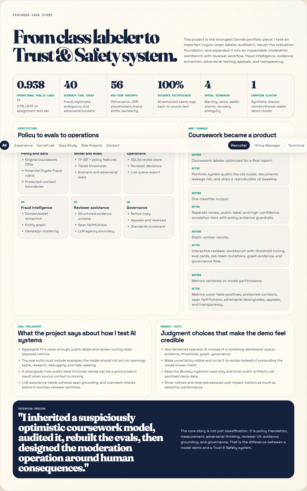

# Crypto Scam Moderation Lab Case Study

## One-Line Summary

I turned a Cornell Trust & Safety policy proposal and coursework labeler into an interactive crypto-scam moderation workbench for Bluesky-style platforms: model audit, reproducible baseline, eval suite, reviewer queue, calibration simulator, incident replay, fraud-intelligence graph, GenAI abuse lab, structured evidence extraction, appeals, and transparency reporting.

[Open the live lab](https://crypto-scam-lab.vercel.app) | [Inspect the source and evaluation artifacts](https://github.com/AliHasan-786/crypto-scam-moderation-lab)

## Why This Project Exists

The original coursework project was an automated Bluesky labeler for crypto-fraud posts. That was a good class artifact, but not enough for a serious portfolio project. A real Trust & Safety system needs more than a classifier:

- a policy boundary
- a reproducible model
- evals that include false-positive risks
- reviewer routing
- operational analytics
- reviewer calibration and QA
- incident response
- evidence display
- adversarial robustness testing
- campaign intelligence
- appeal and reversal handling
- transparency reporting

The portfolio version is framed as an operator workbench, not a model leaderboard.

## Policy Foundation: What Assignment 2 Established

Assignment 2 was the policy specification for the later labeler. It asked how Bluesky should reduce investment scams without treating all financial or cryptocurrency speech as harmful.

- **Definition:** investment scams persuade people to send money to illegitimate or nonexistent opportunities through promises of easy returns, low risk, fake authority, or urgent access. Wallet drainers, fake airdrops, advance-fee recovery, referral fraud, and impersonated support were in scope.
- **ABC spread model:** actors included fake coaches, bots, impersonators, and compromised users; behaviors included unsolicited DMs, fabricated testimonials, mass tagging, and repeated external links; content included wallet asks, referral posts, promotional graphics, and guaranteed-return claims.
- **SxR justification:** the harm has high severity because losses can be financially and emotionally devastating, and high platform responsibility because feeds, reposts, DMs, and decentralized labelers influence reach and intervention.
- **AIM and ABC response:** verify financial promoters, cluster reused domains and wallets, rate-limit suspicious bursts, warn before risky links, combine automated detection with human review, and use appeals and reviewer feedback to improve decisions.
- **Boundaries:** blanket crypto bans, manual pre-approval, and reports-only enforcement were rejected. News, education, warnings, satire, technical discussion, and help-seeking should remain visible; enforcement should use minimal data, multi-source evidence, transparent notices, and appeals.

That policy boundary is the organizing logic for the portfolio system. The model is one component; the product must also decide when evidence is strong enough for a public label, when ambiguity belongs in review, and when the platform should leave speech alone.

## Workbench Contents

The rebuild turns the original labeler into a small moderation command center for social-media crypto scams. It catches obvious scams, sends uncertain posts to review, avoids labeling warnings or jokes, and exposes the machinery a real platform would need around the model:

- model audit and reproducible v2 baseline
- conservative policy rubric and protected-context rules
- reviewer queue, threshold controls, and evidence views
- scenario, adversarial, hardening, evidence, calibration, and launch-gate evals
- SQL-readable queue analytics and entity/campaign graphing
- interactive 12-case reviewer calibration plus quality standards
- incident replay, runbook, tabletop scenarios, mitigations, and postmortem prompts
- deterministic GenAI abuse variants and agent-assistant guardrail checks
- public-safe campaign gallery for repeated infrastructure, recovery, support, warning, and OCR patterns
- appeal scenarios, reversal tracking, notice copy, and transparency reporting

## What Changed From The Coursework Version

| Coursework Version | Portfolio Version |
| --- | --- |
| Hybrid classifier with unclear model-selection hygiene. | Audited original implementation and documented leakage/consistency risks. |
| Single automated labeler framing. | Tiered workflow: no action, human review, public label candidate, high-confidence escalation. |
| Metrics centered on assignment output. | Metrics include public-label precision/recall, review-or-label recall, adversarial retention, span faithfulness, appeal reversals, ops health, calibration coverage, and standards controls. |
| Static report. | Interactive browser lab with queue, tester, threshold tuning, evals, adversarial lab, ops, QA, incident, graph, evidence, and governance panels. |
| Text-only moderation. | Entity extraction and campaign graph for reused domains, wallets, handles, brands, and risk phrases. |
| No procedural-fairness layer. | Notice templates, authored appeal scenarios, reversal tracking, transparency report, and standards scorecard. |

## System Architecture

## Key Metrics

- V2 operational public-label F1: **0.938**
- V2 public-label precision: **0.882**
- V2 public-label recall: **1.000**
- V2 confusion matrix: **TN 100, FP 8, FN 0, TP 60**
- Scenario/adversarial eval cases: **40**
- Authored scenario cases: **19**
- Generated adversarial eval cases: **21**
- Eval expectation pass rate: **100.0%**
- Public-label eval F1: **100.0%** on the scenario/adversarial suite
- Production-hardening eval cases: **12**
- Hardening expectation pass rate: **100.0%**
- URL evidence cases: **7**
- Canonicalization-applied cases: **9**
- Controlled red-team variants: **56**
- Review-or-label retention on mutations: **100.0%**
- Public-label retention on mutations: **82.1%**
- Structured evidence extractor cases: **19**
- Evidence span faithfulness: **100.0%**
- Local queue candidates: **5 sanitized demo items**
- Ops analytics: **60.0% review coverage, 2-item backlog, 8 total observations**
- Reviewer calibration: **12 answer-key cases, 7 protected-context cases**
- Incident response: **3 tabletop scenarios, 1 SEV2 campaign scenario, 2 SEV3 scenarios**
- Launch gate: **11 checks, 0 failures**
- Campaign graph: **21 entities, 6 shared entities, 1 synthetic campaign cluster**
- Governance report: **4 appeal scenarios, 2 reversals, 0.914 standards scorecard average**

## Evaluation Philosophy

The central evaluation argument is that aggregate F1 is not enough for Trust & Safety.

I separated:

- **public-label precision/recall**: when is it safe to show a public label?
- **review-or-label recall**: did risky content at least reach a human workflow?
- **protected-context behavior**: warnings, research, satire, developer debugging, and help-seeking should suppress public labels.
- **adversarial retention**: obfuscation should not fully escape detection.
- **hardening behavior**: canonicalization, defanged URLs, shorteners, OCR/source ambiguity, Spanish-language phrasing, and market-news false positives should be tested directly.
- **downgrade behavior**: moving from public label to human review can be correct when context is missing.
- **LLM evidence faithfulness**: extracted evidence must be backed by source spans.
- **governance metrics**: appeals, reversals, automation-assisted rate, and false-positive categories.
- **ops metrics**: review coverage, backlog, action distribution, false-positive candidates, and entity leads.
- **quality metrics**: reviewer answer-key coverage, protected-context calibration, and QA process readiness.
- **incident readiness**: severity tiers, escalation criteria, mitigations, postmortems, and launch gates.

The core point: the project shows evals that measure product risk, not only model accuracy.

## Product Design Decisions

The product surface is intentionally an operator tool:

- context-first overview before the interactive moderation tools
- dense queue, evidence, metric, and graph panels
- restrained colors and typography
- no marketing-style hero inside the lab
- no hidden uncertainty
- no autonomous moderation action
- public demo uses sanitized data
- live Bluesky ingestion remains read-only and local
- LLM output is reviewer assistance only
- appeal and reversal flows are visible
- hardening failures are treated as product signals, not hidden defects
- ops analytics, calibration, incident response, and launch gates are visible because real safety work depends on repeatable process

The strongest product decision is restraint. The system does not pretend to know intent from one post. If source, link destination, OCR quality, or speaker context is missing, the system routes to review. When a hardening eval finds overreach, the fix is targeted to the policy boundary rather than hidden behind a higher aggregate score.

## Screenshots

### Lab Desktop Overview

### Appeals And Transparency Panel

### Mobile Reviewer View

### Portfolio Case Study Section

## Project Narrative

> I inherited a coursework crypto-scam labeler that looked impressive but had reproducibility and evaluation issues. I audited it, rebuilt a simpler baseline, then expanded the project into a Trust & Safety workbench with evals, reviewer routing, adversarial testing, campaign graphing, structured evidence extraction, and governance reporting.

> The v2 model uses TF-IDF plus explicit policy features and calibrated tiers for review, label, and escalation. The important part is the eval layer: I separated public-label metrics from review-or-label recall, added protected-context cases, adversarial mutation tests, span-faithfulness checks for evidence extraction, and governance metrics for appeals and reversals.

> The product judgment is that moderation is not a single threshold. Public labels require stronger evidence. Ambiguity routes to human review. Warnings, satire, research, debugging, and help-seeking suppress public labels. The UI makes those tradeoffs inspectable.

> The project moves through the stack: policy definition, classifier, evals, review workflow, entity/campaign intelligence, red-team robustness, evidence summaries, appeals, and transparency reporting. That is closer to how real Trust & Safety systems work.

> After the core build, I added a hardening suite for deployment-pressure cases: leetspeak, defanged domains, URL shorteners, OCR/source ambiguity, Spanish-language prompts, and protected-context false positives. The first run caught two issues, I patched the policy layer narrowly, and the rerun passed while preserving the report.

## Known Limitations

- The assignment dataset is small and English-centric.
- The scenario suite is authored, not an untouched external benchmark.
- The production-hardening suite is authored and should be expanded with observed campaigns.
- The campaign graph uses sanitized demo examples and deterministic extraction.
- The adversarial lab is controlled, not a live adversary benchmark.
- URL evidence is deterministic and no-fetch; it does not resolve redirects or crawl landing pages.
- The evidence extractor is deterministic, not a hosted LLM adapter yet.
- Appeal flows are authored scenarios, not a production appeal backend.
- Live Bluesky integration is read-only and local; no labels or reports are published.

These are not hidden. They are part of the project story: the system is honest about what is production-grade and what is a portfolio-grade scaffold.

## Next Extensions

- Final static deployment of the lab and portfolio case study.
- Hosted LLM evidence adapter gated by schema and faithfulness evals.
- Live URL redirect resolution and landing-page evidence capture beyond deterministic URL evidence.
- OCR/image evidence extraction for screenshot scams.
- Account-history enrichment and near-duplicate clustering.
- Multilingual scam evals.
- Active-learning loop from reviewer outcomes.
- Authenticated appeal backend with SLA tracking and privacy controls.
